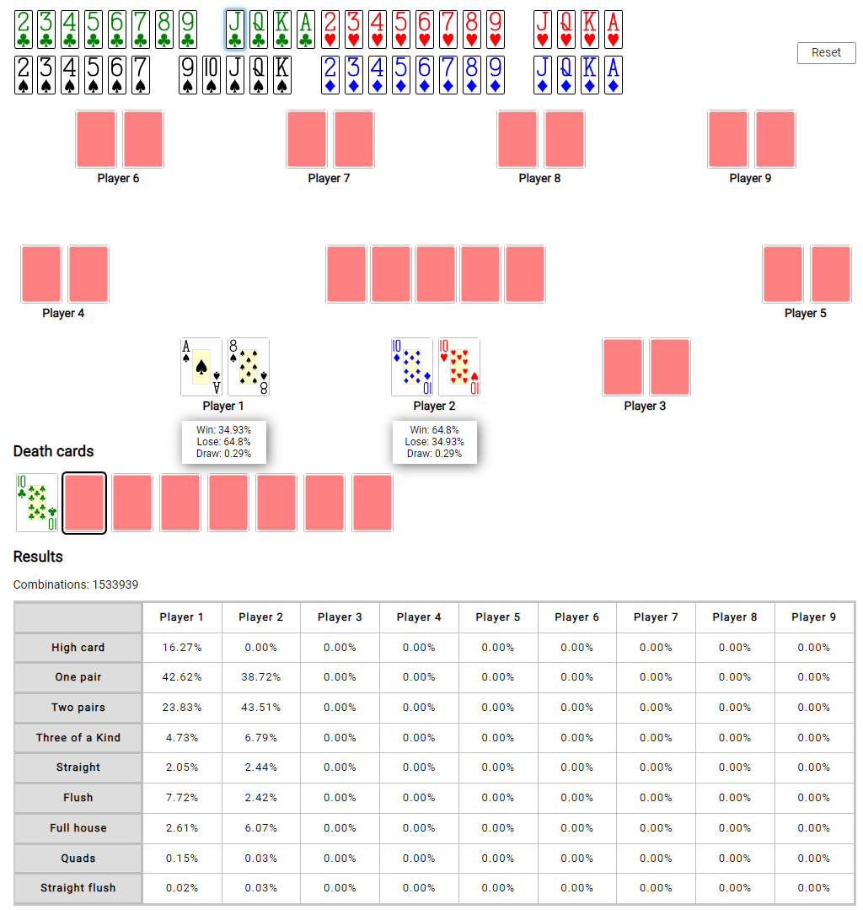

# Poker Master Tool
Open-source poker hand calculator available on https://pokermastertool.bartoszputek.pl/
## Table of contents
* [General info](#general-info)
* [Architecture](#architecture)
* [Features](#features)
* [Quick start with Docker](#quick-start-with-docker)
* [Installation](#installation)
* [Unit and performance tests](#unit-and-performance-tests)
* [Development](#development)
* [License](#license)

## General info
This project has been written to a develop fast open-source hand calculator for Texas Hold'em as an Engineering Thesis. It uses TwoPlusTwo evaluator for calculating hand ranks. The repository contains unit and performance tests, Docker image with Docker Compose for quick start and configured CI/CD with GitHub Actions.



## Architecture
The Application is split into 3 projects:
* Node.js backend application built with Typescript and Express.js framework 
* Frotend written in pure JavaScript and Webpack bundler located in `frontend` directory
* C++ Addon with TwoPlusTwo table generator in `addon` directory

## Features
* Responsive web application for Poker Texas Hold'em odds calculator up to 9 players
* Displaying the number of enumerated combinations and hand rank probability for each player
* Support for Death Cards
* Request caching on the backend side
* Logging requests with log retention politics stored inside `logs` directory

## Quick start with Docker

Turn on Docker and in your terminal run:

```bash
docker-compose up
```

App will be listening on `http://localhost:3000`.

## Installation

To install the application you should have installed Node 16 version.

Next, follow consecutive commands:

```bash
npm install 

npm run build:all

npm run start
```

The app will be listening on `http://localhost:3000`.

## Unit and performance tests

Unit tests are written in Jest testing framework.

To run unit tests run:

```bash
npm run test
```

if you wish to get a coverage report you run `npm run test:coverage`.

To run performance tests for addon run:

```bash
npm run test:performance
```

if you wish to print results and manually validate results run `npm run test:performance:printResults`.

## Development

To serve a frontend by the backend application you should build the frontend first using `npm run build:frontend`. After that you can run the backend development server with:

```bash
npm run dev
```

When you work on the frontend you may wish to dynamically rebuild the project. To run the frontend development server run:

```bash
npm run dev:frontend
```

## License
You can check out the full license [here](./LICENSE)

This project is licensed under the terms of **the MIT license**.